# BMAD Method Training Guide
## From Development Chaos to AI-Powered Excellence

*Everything you need to know to ship faster, build better, and actually enjoy software development again*

> **💡 The Big Promise:** After this training, you'll wonder how your team ever shipped anything without BMAD. We're not overselling—this methodology really does transform how teams build software.

---

## Table of Contents

1. [Executive Summary](#executive-summary)
2. [The Living Context Revolution](#the-living-context-revolution)
3. [BMAD Methodology Overview](#bmad-methodology-overview)
4. [Agent Architecture & Roles](#agent-architecture--roles)
5. [Process Flows & Workflows](#process-flows--workflows)
6. [Slash Commands Reference](#slash-commands-reference)
7. [Role-Specific Relevance](#role-specific-relevance)
8. [Implementation Patterns](#implementation-patterns)
9. [Quick Reference Cards](#quick-reference-cards)

---

## Executive Summary

### What is BMAD?

Think of **BMAD** (Breakthrough Method for Agile AI-Driven Development) as your team's AI-powered mission control for software development. Instead of juggling scattered tools and hoping everyone stays aligned, BMAD gives you specialized AI agents that work like expert teammates—each with their own superpowers.

Whether you're a developer tired of unclear requirements, a product manager drowning in documentation, or a UX designer whose brilliant designs get lost in translation, BMAD creates a shared language and workflow that keeps everyone on the same page.

### Why Teams Love BMAD

**🚀 Ship Faster** → Structured AI collaboration accelerates development up to 10x  
**📊 Plan Better** → Progressive context building means no more "Wait, what are we building again?"  
**✅ Build Right** → Specialized agents catch issues before they become expensive problems  
**🤝 Stay Aligned** → Everyone from Product to DevOps speaks the same language  
**📈 Scale Smart** → Framework adapts whether you're fixing a bug or building a platform  
**🧠 Remember Everything** → Knowledge stays in the system, not locked in someone's head  

### Who This Training Is For

**If you're joining a BMAD team, this guide is for you:**
- **Developers** → Learn how AI agents enhance (don't replace) your expertise
- **Product Managers** → Discover structured requirements that actually work
- **UX Designers** → See how your designs integrate seamlessly into development
- **DevOps Engineers** → Understand how infrastructure fits into the workflow
- **Scrum Masters** → Master AI-augmented team coordination
- **Architects** → Build systems with embedded decision-making

### What You'll Walk Away With

After this training, you'll confidently:
✓ Navigate BMAD's four development phases  
✓ Know which AI agent to call for any situation  
✓ Use slash commands like a pro  
✓ Apply BMAD to your specific role and responsibilities  
✓ Guide projects from idea to deployment using structured workflows

---

## The Living Context Revolution

### Why "Vibe-Driven Development" Fails

Before we dive into BMAD's methodology, let's talk about why most AI-assisted development feels unreliable and frustrating.

**The Traditional Approach: "Vibe Coding"**
Most developers using AI today are essentially doing "vibe coding"—throwing prompts at ChatGPT or Claude, getting code back, and hoping it works with their existing codebase. It's like asking a brilliant stranger to help you finish a conversation they've never heard before.

The results? Inconsistent. Sometimes magical, sometimes completely off-base. Sound familiar?

### The Root Problem: Context Windows

Here's the technical reality that makes "vibe coding" so unreliable:

**What is a Context Window?**
Think of a context window as an AI's "working memory." Just like humans can only hold so much information in their head at once, AI models have limits on how much text they can consider when generating responses.

- **GPT-4**: ~8,000-32,000 tokens (roughly 6,000-24,000 words)
- **Claude**: ~100,000-200,000 tokens (roughly 75,000-150,000 words)  
- **Your Codebase**: Probably millions of words

**The Math Problem:** Your project context is usually much larger than any AI can hold in its "head" at once.

### The Partnership: Mutual Accommodation for Better Results

**Think of AI agents as coworkers who need specific accommodations to do their best work.**

They can't see, hear, or access anything not explicitly provided in structured text form. No memory of hallway conversations, no access to tribal knowledge shared over coffee, no intuitive understanding of "how we do things around here." They're also like junior developers who try to keep everything in their head without ever writing down notes.

**But here's the key insight:** The accommodation needs to go both ways.

**What AI Agents Need to Do:**
- **Extend their memory** by writing context, decisions, and patterns to local storage
- **Build comprehensive notes** that capture not just what was decided, but why
- **Create searchable documentation** that compounds over time
- **Maintain consistent patterns** across all project work

**What Human Teams Need to Do:**
- **Write requirements to disk** instead of relying on "everyone just knows"
- **Structure information accessibly** (not as PNGs, conversation threads, or tribal knowledge)
- **Commit to documented processes** rather than ad-hoc "figure it out as we go"
- **Trust the structured approach** even when it feels like "extra overhead"

### The Transformation

**Before BMAD:** You have a junior developer coworker who forgets everything and human teammates who store critical information in their heads or random Slack threads.

**With BMAD:** You have AI agents that meticulously document every decision and human teammates who commit to making information accessible and structured.

**The Result:** Both sides adapt their working style, and the entire team becomes more reliable, consistent, and effective.

**Just like workplace accessibility,** the accommodations that help AI agents succeed also make human collaboration better:
- Documented requirements help humans onboard faster
- Structured decision-making reduces repeated conversations  
- Persistent context prevents "Wait, why did we decide that?" moments
- Comprehensive notes help during code reviews and debugging

**BMAD isn't about dumbing down development for AI limitations — it's about both sides adopting professional practices that create better outcomes for everyone.**

### BMAD's Solution: Living Context

**Living Context** is BMAD's breakthrough solution to the context window problem. Instead of trying to cram everything into the AI's memory at once, BMAD creates a structured, persistent memory system that lives on your local machine.

**Traditional "Vibe Coding" Approach:**


**BMAD Living Context Approach:**


### How Living Context Works

**1. Local Storage as Memory**
BMAD stores workflow state and context information in local files on your machine:
- **PRD.md** → What we're building and why
- **Architecture.md** → How we're building it  
- **Epic files** → What features we're implementing
- **Story files** → Specific implementation details
- **Context memory** → Decisions made, patterns established

**2. Progressive Context Building**
Each phase builds on the previous one:
- Product brief informs the PRD
- PRD guides architecture decisions  
- Architecture shapes story creation
- Stories contain implementation context
- Implementation feeds back into patterns

**3. Context Retrieval & Injection**
When you call a BMAD agent, the system:
- Identifies what context is relevant to your current task
- Loads the appropriate files from local storage
- Injects that context into the AI's prompt
- Ensures the AI always knows "where we are" in the project

### Why This Changes Everything

**🧠 Persistent Memory** → BMAD agents remember decisions, patterns, and context across sessions. No more explaining your project architecture every time.

**📈 Compound Intelligence** → Each interaction makes the system smarter about your specific project. The AI learns your codebase patterns, naming conventions, and architectural decisions.

**🔄 Consistent Results** → Because agents always have full context, their recommendations are consistent with previous decisions and your project's established patterns.

**⚡ Accelerating Returns** → The longer you use BMAD on a project, the better it gets at helping you with that project.

### The Self-Driving Car Moment

**Here's the uncomfortable truth:** BMAD requires you to trust the process.

Just like the first time you let go of a steering wheel in a self-driving car, using BMAD properly means giving AI agents control over aspects of development that you're used to controlling yourself.

**What you're thinking:**
- *"But what if the AI makes the wrong architecture decision?"*
- *"How do I know the PRD captures what I really want?"*
- *"What if the generated stories miss important edge cases?"*

**What BMAD teams discover:**
- The AI makes fewer architecture mistakes than tired humans at 2 AM
- PRDs generated with full context are more complete than most humans write
- Stories created from structured PRDs catch edge cases humans typically miss

**The Counterintuitive Reality:** By giving up control of the *process*, you gain control of the *outcome*.

### BMAD vs. "Vibe Coding" - Head to Head

| **Aspect** | **"Vibe Coding"** | **BMAD Living Context** |
|------------|------------------|------------------------|
| **Consistency** | Hit or miss, depends on prompt quality | Consistent, context-aware results |
| **Context Awareness** | Limited to current conversation | Full project history and decisions |
| **Learning** | Starts fresh every time | Compounds knowledge over time |
| **Quality** | Varies wildly | Predictably high quality |
| **Team Alignment** | Everyone uses different approaches | Standardized, shareable context |
| **Handoffs** | Context gets lost | Seamless context transfer |

### The Trust Building Process

**Phase 1: Skeptical Experimentation** *(Weeks 1-2)*
"I'll try this on small stuff, but I'm watching everything the AI does."

**Phase 2: Cautious Adoption** *(Weeks 3-4)*  
"Okay, this is actually working better than I expected, but I'm still double-checking everything."

**Phase 3: Confident Delegation** *(Month 2+)*
"I trust the process. The AI agents consistently deliver quality work that fits our project context."

**Phase 4: Symbiotic Partnership** *(Month 3+)*
"I can't imagine developing without this. The AI agents feel like expert teammates who never forget anything."

### Making the Leap

**The hardest part isn't learning BMAD—it's trusting it.**

But here's what every successful BMAD team discovers: **The system gets results because it has persistent context, not despite human oversight.**

The AI agents aren't replacing your judgment—they're extending your memory and ensuring your decisions stay consistent across the entire development lifecycle.

**Next up:** Let's explore exactly how this Living Context system works within BMAD's four-phase methodology.

---

## BMAD Methodology Overview

### The Big Idea

BMAD solves the two biggest headaches in software development:

**🤖 Agentic Planning** → Instead of one person trying to do everything, specialized AI agents handle what they do best. Need requirements? The PM agent has you covered. Architecture decisions? The Architect agent is on it. This isn't about replacing humans—it's about having expert AI teammates who never get tired or forget details.

**🧩 Context-Engineered Development** → Ever join a project and spend days figuring out what you're supposed to build? BMAD builds context progressively, so every agent (and every human) always knows exactly what's needed and why. No more "I thought we were building X, but apparently it's Y."

### The Four Phases (Think of it as a GPS for Development)

```mermaid
flowchart TD
    A[Phase 1: Analysis<br/>🔍 What should we build?<br/>Optional] --> B[Phase 2: Planning<br/>📋 How will we build it?<br/>Required]
    B --> C[Phase 3: Solutioning<br/>🏗️ What's the blueprint?<br/>Architecture & Stories]
    C --> D[Phase 4: Implementation<br/>⚡ Let's build it!<br/>Code & Deploy]
    
    A1[Brainstorming] --> A
    A2[Research] --> A
    A3[Product Brief] --> A
    
    B1[PRD Creation] --> B
    B2[UX Design] --> B
    
    C1[Architecture] --> C
    C2[Epic & Stories] --> C
    C3[Readiness Check] --> C
    
    D1[Sprint Planning] --> D
    D2[Story Development] --> D
    D3[Code Review] --> D
    D4[QA Automation] --> D
```



### 🔍 Phase 1: Analysis (Optional, but critical for complex/unclear projects)

**Core Question:** *"What problem are we solving, and is it worth solving?"*

**Goals:**
- Validate that the problem is real and worth the investment
- Understand the competitive landscape and market context
- Align stakeholders on the problem definition and success criteria
- Create a compelling case for why this project should exist

**Key Personas Involved:**
- **Product Managers** → Define business case and market opportunity
- **Analysts/Researchers** → Gather market data, competitive intelligence
- **Stakeholders/Leadership** → Provide strategic direction and funding approval
- **Subject Matter Experts** → Validate technical feasibility and domain requirements

**When to Use Phase 1:**
- New product ideas or major feature initiatives
- Stakeholders have conflicting visions of what to build
- Market opportunity is unclear or unvalidated
- Significant investment requires business case justification
- Technical feasibility is uncertain

**Deliverables:**
- Market research and competitive analysis
- Problem validation data
- Strategic product brief with clear success metrics
- Stakeholder alignment on project direction

---

### 📋 Phase 2: Planning (Always required—your project's foundation)

**Core Question:** *"Exactly what are we building, and how will users interact with it?"*

**Goals:**
- Transform validated problems into detailed, implementable requirements
- Define user experience and interaction patterns
- Establish clear acceptance criteria and success metrics
- Create shared understanding across all team members

**Key Personas Involved:**
- **Product Managers** → Requirements definition, user story creation, scope management
- **UX Designers** → User experience design, interaction patterns, accessibility
- **Business Stakeholders** → Feature prioritization, business rule definition
- **End Users** → User experience validation (through UX research/testing)

**Critical Outputs:**
- **Product Requirements Document (PRD)** → The single source of truth for what you're building
- **UX Specifications** → How users will interact with the system
- **User Stories** → Detailed scenarios and acceptance criteria
- **Success Metrics** → How you'll measure if the project succeeded

**Why This Phase is Never Optional:**
- Without clear requirements, development becomes expensive guesswork
- UX decisions made during coding are usually suboptimal
- Missing acceptance criteria lead to endless scope creep
- Teams without shared understanding build different things

---

### 🏗️ Phase 3: Solutioning (Where requirements become buildable architecture)

**Core Question:** *"How will we actually build this thing?"*

**Goals:**
- Design technical architecture that meets all requirements
- Break large features into manageable, prioritized work items
- Identify technical risks and dependencies early
- Ensure development team understands implementation approach

**Key Personas Involved:**
- **Technical Architects** → System design, technology choices, scalability planning
- **Senior Developers** → Implementation patterns, technical feasibility validation
- **DevOps Engineers** → Deployment architecture, operational requirements
- **QA Engineers** → Testing strategy, quality gates definition
- **Product Managers** → Epic breakdown, story prioritization

**Critical Activities:**
- **Architecture Design** → Technical blueprints with documented decision rationale
- **Epic & Story Creation** → Requirements broken into implementable work units
- **Implementation Readiness Check** → Validation that everything is ready for development
- **Risk Assessment** → Technical and timeline risk identification

**Why This Phase Prevents Project Disasters:**
- Architecture decisions made under time pressure are usually wrong
- Epic breakdown without technical input leads to unrealistic timelines
- Missing dependencies cause cascading delays
- Implementation readiness checks catch scope/technical mismatches before expensive rework

---

### ⚡ Phase 4: Implementation (Where plans become working software)

**Core Question:** *"How do we build this efficiently while maintaining quality?"*

**Goals:**
- Transform architectural plans into tested, deployable software
- Maintain consistent quality standards throughout development
- Adapt to discoveries and changing requirements without derailing the project
- Deliver working software that meets all defined acceptance criteria

**Key Personas Involved:**
- **Developers** → Code implementation, unit testing, technical problem-solving
- **QA Engineers** → Test automation, quality validation, bug identification
- **DevOps Engineers** → Deployment, monitoring, operational support
- **Scrum Masters/Project Managers** → Sprint coordination, progress tracking, impediment removal
- **Product Owners** → Acceptance criteria validation, priority adjustments

**Implementation Workflow:**
- **Sprint Planning** → Convert epics/stories into actionable development tasks
- **Story Development** → Code implementation with full context from previous phases
- **Code Review** → Quality validation using established patterns and standards  
- **QA Automation** → Comprehensive testing aligned with acceptance criteria
- **Deployment** → Reliable delivery to production environments

**What Makes BMAD Implementation Different:**
- Developers have complete context from all previous phases
- Architecture decisions are documented and accessible
- Quality standards are defined before coding begins
- Every story has clear acceptance criteria and success metrics
- Implementation patterns are consistent across the project

**Success Metrics:**
- Features delivered match original requirements (no scope drift)
- Code quality meets established standards
- Deployment process is reliable and repeatable
- User acceptance criteria are consistently met

### Pick Your Adventure: Three Planning Tracks

Not every project needs the full BMAD treatment. Choose your track based on complexity:

| **When to Use** | **Track** | **What You Get** | **Team Size** |
|-----------------|-----------|------------------|---------------|
| "This should be quick and straightforward" | **🏃 Quick Flow** | Tech-spec only<br/>*Perfect for bug fixes, simple features (1-15 stories)* | 1-2 developers |
| "This is a real project that matters" | **🎯 BMAD Method** | PRD + Architecture + UX<br/>*Best for products, platforms, complex features (10-50+ stories)* | 3-8 team members |
| "This is mission-critical and can't break" | **🏢 Enterprise** | PRD + Architecture + Security + DevOps<br/>*Required for compliance, multi-tenant systems (30+ stories)* | 8+ team members |

**💡 Pro Tip:** When in doubt, start with Quick Flow. You can always upgrade to a more comprehensive track if the scope grows.

### Document Flow & Context Building


Each document becomes context for the next phase, ensuring consistent decision-making throughout development.

---

## Meet Your AI Team: Agent Architecture & Roles

### Your New AI Coworkers

Think of BMAD agents as specialized teammates who never take sick days, never forget context, and always bring their A-game. Each agent is like having an expert consultant who knows exactly what they're good at:

Here's your AI dream team (12+ specialized agents, each with superpowers):


### Core Agent Roles

#### 🔍 **Analyst Agent** - *"The Researcher"*
**What they're great at:** Market research, competitive analysis, validating ideas  
**Call them when:** You're starting a new project, need to validate an idea, or want to understand the competitive landscape  
**They'll give you:** Research findings, competitive analysis, product briefs that make stakeholders nod  
**Magic words:** `/bmad-agent-bmm-analyst`

#### 📊 **Product Manager Agent** - *"The Translator"*  
**What they're great at:** Turning fuzzy ideas into crystal-clear requirements  
**Call them when:** You need a PRD, want to break down big features into manageable stories, or need to wrangle scope creep  
**They'll give you:** Rock-solid PRD.md files, well-structured epics, realistic sprint plans  
**Magic words:** `/bmad-agent-bmm-pm`

#### 🏗️ **Architect Agent** - *"The Blueprint Maker"*  
**What they're great at:** Making smart technical decisions and documenting why  
**Call them when:** You're designing system architecture, choosing technologies, or planning for scale  
**They'll give you:** Architecture.md with clear ADRs (Architecture Decision Records) that future-you will thank you for  
**Magic words:** `/bmad-agent-bmm-architect`

#### 🎨 **UX Designer Agent** - *"The User Whisperer"*  
**What they're great at:** Making sure your users actually *want* to use what you build  
**Call them when:** You're building user-facing features, need design consistency, or want to ensure accessibility  
**They'll give you:** UX-spec.md files, wireframes, and design specs that developers can actually follow  
**Magic words:** `/bmad-agent-bmm-ux`

#### 👨‍💻 **Developer Agent** - *"The Code Craftsperson"*  
**What they're great at:** Writing clean, tested code that does exactly what the story says  
**Call them when:** It's time to implement stories, fix bugs, or review code quality  
**They'll give you:** Working code, comprehensive unit tests, and clear implementation docs  
**Magic words:** `/bmad-agent-bmm-dev`

#### 🛡️ **QA Engineer Agent** - *"The Safety Net"*  
**What they're great at:** Catching problems before your users do  
**Call them when:** You need test automation, quality gates, or comprehensive testing strategy  
**They'll give you:** Test suites that run automatically, QA docs, and quality reports that give you confidence to ship  
**Magic words:** `/bmad-agent-bmm-qa`

#### 📋 Scrum Master Agent
- **Expertise**: Process management, sprint planning, team coordination
- **When to Use**: Sprint management, retrospectives, process optimization
- **Outputs**: Sprint status, retrospective reports, process improvements
- **Command**: `/bmad-agent-bmm-sm`

### Agent Collaboration Patterns


---

## Process Flows & Workflows

### Phase 1: Analysis (Optional)

**Purpose**: Validate problems, align stakeholders, and create compelling business case before major investment.

**Key Participants**: Product Managers, Analysts, Leadership, Subject Matter Experts


**Workflows Available:**
- `brainstorming` - Guided ideation with brainstorming coach
- `research` - Market/technical/domain validation
- `create-product-brief` - Strategic vision capture

### Phase 2: Planning (Required)

**Purpose**: Transform problems into detailed, implementable requirements with clear user experience.

**Key Participants**: Product Managers, UX Designers, Business Stakeholders, End Users (via research)


**Key Outputs:**
- **PRD.md**: Complete product requirements document
- **UX-spec.md**: User experience specifications (when needed)
- **Tech-spec.md**: Technical specification (Quick Flow only)

### Phase 3: Solutioning

**Purpose**: Design technical architecture and break requirements into manageable, prioritized work items.

**Key Participants**: Technical Architects, Senior Developers, DevOps Engineers, QA Engineers, Product Managers


**Key Outputs:**
- **Architecture.md**: Technical decisions with ADRs
- **Epic files**: High-level feature definitions
- **Story files**: Implementable development units
- **Readiness assessment**: PASS/CONCERNS/FAIL decision

### Phase 4: Implementation

**Purpose**: Transform architectural plans into tested, deployable software while maintaining quality.

**Key Participants**: Developers, QA Engineers, DevOps Engineers, Scrum Masters, Product Owners


**Story Development Cycle:**
1. **Create Story**: Convert epic to implementable story
2. **Develop Story**: Implement code with tests
3. **Code Review**: Quality validation
4. **QA Automation**: Generate additional tests

---

## Slash Commands Reference

### Core Workflow Commands

#### Phase 1: Analysis
```bash
/bmad-help                           # Get guidance on next steps
/bmad-brainstorming                  # Guided brainstorming session
/bmad-bmm-research                   # Market/technical research
/bmad-bmm-create-product-brief       # Create strategic vision document
```

#### Phase 2: Planning
```bash
/bmad-bmm-create-prd                 # Create Product Requirements Document
/bmad-bmm-create-ux-design           # Create UX specifications
/bmad-bmm-quick-spec                 # Quick Flow: Create tech spec
```

#### Phase 3: Solutioning
```bash
/bmad-bmm-create-architecture        # Design system architecture
/bmad-bmm-create-epics-and-stories   # Break PRD into implementable work
/bmad-bmm-check-implementation-readiness # Validate planning cohesion
```

#### Phase 4: Implementation
```bash
/bmad-bmm-sprint-planning            # Initialize sprint tracking
/bmad-bmm-create-story              # Convert epic to story file
/bmad-bmm-dev-story                 # Implement story with code
/bmad-bmm-code-review               # Review implementation quality
/bmad-bmm-qa-automate               # Generate automated tests
/bmad-bmm-correct-course            # Handle mid-sprint changes
/bmad-bmm-retrospective             # Review epic completion
```

### Agent Loading Commands
```bash
/bmad-agent-bmm-analyst             # Load Analyst agent
/bmad-agent-bmm-pm                  # Load Product Manager agent
/bmad-agent-bmm-architect           # Load Architect agent
/bmad-agent-bmm-ux                  # Load UX Designer agent
/bmad-agent-bmm-dev                 # Load Developer agent
/bmad-agent-bmm-qa                  # Load QA Engineer agent
/bmad-agent-bmm-sm                  # Load Scrum Master agent
```

### Command Execution Best Practices

1. **Fresh Context**: Run each workflow in a fresh chat for optimal results
2. **Sequential Execution**: Follow the phase order for best context building
3. **Agent Loading**: Load appropriate agent before running workflow commands
4. **Help Command**: Use `/bmad-help` whenever unsure of next steps

---

## Role-Specific Relevance

### For Developers

**Why Developers Actually Like BMAD:** *(Yes, really!)*

🎯 **No More "What Am I Supposed to Build?"** → Story files give you complete context, acceptance criteria, and technical specs. No more Slack-driven development.  

🔍 **Built-in Code Review Buddy** → The code review workflow catches issues before your PR, so you look like a rock star.  

🤖 **QA Automation Without the Pain** → Test generation that actually makes sense and doesn't take forever to write.  

🏗️ **Architecture Decisions Made For You** → The Architect agent handles the big technical choices, so you can focus on writing great code instead of debating frameworks.  

🧠 **Context That Sticks** → All requirements, constraints, and decisions live in structured documents. No more "Who decided we were using Redis again?"  

**Your Daily Dev Commands:**
```bash
/bmad-bmm-dev-story                 # "Give me everything I need to implement this story"
/bmad-bmm-code-review               # "Is this code ready for the real world?"
/bmad-bmm-qa-automate               # "Generate tests that don't suck"
```

**The Sweet Setup:**
Story files → Architecture patterns → Implementation → Automated tests → Code review. It's like having a senior dev, architect, and QA engineer all helping you ship better code faster.

### For Product Managers

**Why PMs Love BMAD:**

🎯 **No More "Requirements Telephone"** → AI-assisted PRD creation means nothing gets lost in translation  
📊 **Epic Breakdown on Autopilot** → Turn big, fuzzy requirements into implementable stories without the usual back-and-forth  
📈 **Actually Useful Progress Tracking** → Sprint planning and retros that generate actionable insights  
📝 **Stakeholder Communication That Works** → Standardized docs that both technical and business teams understand  

**Your PM Superpowers (The Commands You'll Use Daily):**
```bash
/bmad-bmm-create-prd                # Turn ideas into bulletproof requirements
/bmad-bmm-create-epics-and-stories  # Break down big features into manageable work
/bmad-bmm-sprint-planning           # Plan sprints that actually go according to plan
/bmad-bmm-retrospective             # Run retros that lead to real improvements
```

**How It All Connects:**
Think of BMAD as your requirements assembly line: Product briefs → PRDs → Architecture decisions → Epic tracking. Each step builds on the last, so you never lose context or have to re-explain what you're building.

### For UX Designers

**Direct Benefits:**
- **Design Integration**: UX specifications become part of story context
- **User-Centered Development**: UX considerations embedded in development workflows
- **Design System Support**: Consistent patterns across implementation
- **Cross-functional Alignment**: Design decisions documented and shared

**Key Workflows:**
```bash
/bmad-bmm-create-ux-design          # UX specification creation
/bmad-bmm-create-story              # Ensure UX considerations in stories
```

**Integration Points:**
- UX specs inform story creation and implementation
- Design decisions influence architecture patterns
- User research feeds into product brief and PRD

### For DevOps Engineers

**Direct Benefits:**
- **Infrastructure Planning**: DevOps considerations built into architecture phase
- **Deployment Automation**: Standardized deployment patterns per project type
- **Scaling Guidance**: Architecture includes scalability and operational concerns
- **Security Integration**: Security patterns embedded in architecture decisions

**Key Integration Areas:**
- Architecture documents include deployment and scaling strategies
- Epic planning considers operational requirements
- Implementation workflows include deployment validation

**Operational Workflows:**
```bash
/bmad-bmm-create-architecture       # Include infrastructure decisions
/bmad-bmm-check-implementation-readiness # Validate operational readiness
```

### For Scrum Masters

**Direct Benefits:**
- **Process Automation**: Sprint planning and tracking automated
- **Predictable Velocity**: Structured story breakdown improves estimation
- **Risk Management**: Implementation readiness checks prevent scope creep
- **Team Coordination**: Clear handoff points between agents and team members

**Key Workflows:**
```bash
/bmad-bmm-sprint-planning           # Initialize tracking
/bmad-bmm-correct-course            # Handle scope changes
/bmad-bmm-retrospective             # Process improvement
```

**Process Management:**
- Sprint status tracking across all stories and epics
- Automated identification of blocked or at-risk work
- Clear definition of done at each workflow stage

### For Architects

**Direct Benefits:**
- **Decision Documentation**: ADRs (Architecture Decision Records) built into workflow
- **Technical Context**: Architecture informs all downstream implementation
- **Quality Gates**: Implementation readiness checks ensure architectural integrity
- **Pattern Reuse**: Consistent architectural patterns across projects

**Key Workflows:**
```bash
/bmad-bmm-create-architecture       # System design and ADRs
/bmad-bmm-check-implementation-readiness # Architectural validation
```

**Design Artifacts:**
- Architecture documents with technical decisions
- ADRs for major architectural choices
- Implementation patterns and constraints
- Scalability and performance considerations

---

## Implementation Patterns

### Project Structure

BMAD creates a standardized project structure that supports the methodology:

```
your-project/
├── _bmad/                          # BMAD configuration
│   ├── agents/                     # Agent definitions
│   ├── workflows/                  # Workflow templates
│   ├── tasks/                      # Reusable task definitions
│   └── config/                     # Project configuration
├── _bmad-output/                   # Generated artifacts
│   ├── PRD.md                      # Product Requirements Document
│   ├── architecture.md             # Architecture with ADRs
│   ├── ux-spec.md                  # UX specifications (optional)
│   ├── epics/                      # Epic and story files
│   │   ├── epic-001-user-auth.md
│   │   └── story-001-001-login.md
│   ├── sprint-status.yaml          # Sprint tracking
│   └── project-context.md          # Project context summary
└── src/                            # Your source code
```

### Context Management Pattern

BMAD uses progressive context building to ensure consistency:


**Context Loading Rules:**
- Each workflow loads only relevant documents
- Implementation workflows load project-context.md automatically
- Fresh chat windows prevent context pollution
- Document versioning maintains consistency

### Integration Patterns

#### CI/CD Integration
```yaml
# .github/workflows/bmad-qa.yml
name: BMAD QA Automation
on: [push, pull_request]
jobs:
  bmad-tests:
    runs-on: ubuntu-latest
    steps:
      - uses: actions/checkout@v3
      - name: Run BMAD QA
        run: |
          # Load QA agent and run automation
          /bmad-bmm-qa-automate
```

#### IDE Integration
```json
// .vscode/tasks.json
{
  "tasks": [
    {
      "label": "BMAD: Create Story",
      "type": "shell",
      "command": "/bmad-bmm-create-story",
      "group": "build"
    },
    {
      "label": "BMAD: Dev Story",
      "type": "shell", 
      "command": "/bmad-bmm-dev-story",
      "group": "build"
    }
  ]
}
```

### Scaling Patterns

#### Team Size Scaling
- **1-2 developers**: Quick Flow track, minimal overhead
- **3-8 team members**: Full BMAD Method with all phases
- **8+ team members**: Enterprise track with additional governance

#### Project Complexity Scaling
- **Simple features**: Tech-spec → Implementation
- **Product features**: PRD → Architecture → Stories → Implementation  
- **Enterprise systems**: Full governance with security, compliance, DevOps

### Quality Patterns

#### Definition of Done by Phase
```yaml
Phase_1_Analysis:
  - Product brief approved by stakeholders
  - Research findings documented
  - Success metrics defined

Phase_2_Planning:
  - PRD peer reviewed
  - UX specifications (if applicable)
  - Acceptance criteria clear

Phase_3_Solutioning:
  - Architecture peer reviewed
  - ADRs documented for major decisions
  - Stories estimated and prioritized
  - Implementation readiness: PASS

Phase_4_Implementation:
  - Code implemented per story
  - Unit tests written
  - Code review passed
  - QA automation complete
```

---

## Quick Reference Cards

### Cheat Sheet 1: "What Track Should I Use?" 

| **What You're Thinking** | **Pick This** | **Start Here** |
|--------------------------|---------------|----------------|
| "This is a simple bug fix" | 🏃 **Quick Flow** | `/bmad-bmm-quick-spec` |
| "We're building a real feature" | 🎯 **BMAD Method** | `/bmad-bmm-create-prd` |
| "This is mission-critical stuff" | 🏢 **Enterprise** | `/bmad-bmm-create-prd` |
| "Nobody knows what we're building" | 🔍 **Full Analysis** | `/bmad-brainstorming` |
| "Time to pay down technical debt" | 🏃 **Quick Flow** | `/bmad-bmm-quick-spec` |

**🤔 Still not sure?** Start with Quick Flow. You can always upgrade if it gets more complex than expected.

### Cheat Sheet 2: Your Go-To Command Sequences

#### 🏗️ **New Feature Development** (The Full Journey)
```bash
1. /bmad-agent-bmm-pm           # → "Let's get the PM to help us plan"
2. /bmad-bmm-create-prd         # → "Create solid requirements"
3. /bmad-agent-bmm-architect    # → "Bring in the architecture expert"  
4. /bmad-bmm-create-architecture # → "Design the technical approach"
5. /bmad-agent-bmm-pm           # → "Back to PM for story breakdown"
6. /bmad-bmm-create-epics-and-stories # → "Turn PRD into implementable work"
7. /bmad-agent-bmm-architect    # → "Final readiness check"
8. /bmad-bmm-check-implementation-readiness # → "Are we ready to build?"
```

#### ⚡ **Story Implementation** (Daily Developer Flow)
```bash
1. /bmad-agent-bmm-sm           # → "Get the Scrum Master to prep the story"
2. /bmad-bmm-create-story       # → "Create detailed story file"
3. /bmad-agent-bmm-dev          # → "Time to code!"
4. /bmad-bmm-dev-story          # → "Implement with full context"
5. /bmad-agent-bmm-dev          # → "Get code review help"
6. /bmad-bmm-code-review        # → "Make sure it's ship-ready"
```

#### 🏃 **Quick Fix** (When You Just Need It Done)
```bash
1. /bmad-bmm-quick-spec         # → "Quick technical specification"
2. /bmad-bmm-quick-dev          # → "Implement and ship"
3. /bmad-bmm-code-review
```

### Cheat Sheet 3: Troubleshooting Guide

| **Issue** | **Solution** | **Command** |
|-----------|-------------|-------------|
| Unclear next steps | Get guidance | `/bmad-help` |
| Scope changed mid-sprint | Course correction | `/bmad-bmm-correct-course` |
| Architecture concerns | Readiness check | `/bmad-bmm-check-implementation-readiness` |
| Need project context | Document project | `/bmad-bmm-document-project` |
| Quality issues | QA automation | `/bmad-bmm-qa-automate` |

### Cheat Sheet 4: Agent Expertise Matrix

| **Need** | **Agent** | **Command** | **Best For** |
|----------|-----------|-------------|-------------|
| Market research | Analyst | `/bmad-agent-bmm-analyst` | Validation, competition |
| Requirements | PM | `/bmad-agent-bmm-pm` | PRDs, stories, planning |
| System design | Architect | `/bmad-agent-bmm-architect` | Technical decisions, ADRs |
| User experience | UX | `/bmad-agent-bmm-ux` | Interface design, usability |
| Implementation | Developer | `/bmad-agent-bmm-dev` | Coding, code review |
| Testing | QA | `/bmad-agent-bmm-qa` | Test automation, quality |
| Process | Scrum Master | `/bmad-agent-bmm-sm` | Sprint management, tracking |

### Cheat Sheet 5: Document Dependencies


---

## Training Completion Checklist

### Phase 1: Understanding
- [ ] Understand BMAD's four-phase methodology
- [ ] Know the three planning tracks and when to use each
- [ ] Recognize the role of specialized agents
- [ ] Understand progressive context building

### Phase 2: Practical Application
- [ ] Successfully run `/bmad-help` command
- [ ] Complete a Quick Flow workflow
- [ ] Create a PRD using the PM agent
- [ ] Generate architecture with the Architect agent
- [ ] Implement a story using the Developer agent

### Phase 3: Role Integration  
- [ ] Identify how BMAD applies to your specific role
- [ ] Understand cross-functional collaboration points
- [ ] Know when to escalate or collaborate with other roles
- [ ] Recognize quality gates relevant to your work

### Phase 4: Production Readiness
- [ ] Understand project structure and file organization
- [ ] Know troubleshooting steps for common issues
- [ ] Can navigate between phases and workflows confidently
- [ ] Ready to implement BMAD on real projects

---

## You're Ready to BMAD! 🚀

Congratulations! You now have everything you need to start using BMAD effectively. Remember:

**🎯 Start Small** → Try Quick Flow on your next bug fix or small feature  
**🤝 Ask for Help** → The Discord community is incredibly supportive  
**📈 Build Gradually** → Move to BMAD Method once you're comfortable  
**🎉 Celebrate Wins** → You'll be amazed how much faster and smoother development becomes  

**Your First Mission:** Pick something small you're working on this week and try `/bmad-help` or `/bmad-bmm-quick-spec`. Even if it feels a bit awkward at first, you'll quickly see why teams that adopt BMAD never want to go back to the old way.

**Remember:** BMAD isn't about replacing human expertise—it's about amplifying it. You bring the creativity, problem-solving, and domain knowledge. BMAD brings structure, consistency, and a team of AI experts who never forget context.

Welcome to the future of development. Let's build something amazing! 💪

---

## Additional Resources

### Official Documentation
- [BMAD Method Docs](https://docs.bmad-method.org/)
- [GitHub Repository](https://github.com/bmad-code-org/BMAD-METHOD)
- [Workflow Map](https://docs.bmad-method.org/reference/workflow-map/)

### Community & Support
- [Discord Community](https://discord.gg/gk8jAdXWmj)
- [YouTube Channel](https://www.youtube.com/@BMadCode)
- [GitHub Issues](https://github.com/bmad-code-org/BMAD-METHOD/issues)

### Compatible Tools
- **Claude Code** (Recommended)
- **Cursor** - AI-first code editor
- **Windsurf** - Codeium's AI IDE  
- **Kiro** - Amazon's AI-powered IDE
- **Roo Code** - VS Code extension

---

*This training guide is designed to be both a learning resource and an ongoing reference. Keep it accessible during your BMAD implementation journey.*

**Version**: 1.0  
**Last Updated**: February 2026  
**Training Duration**: 2-4 hours (self-paced)