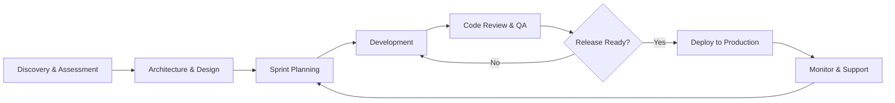
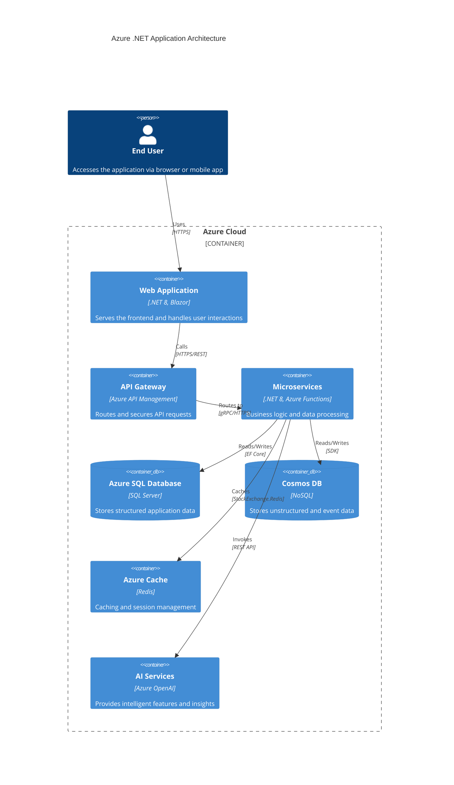

# Modern Microsoft App Development
## Empowering Businesses To Adapt & Excel With Cloud-Native .NET Applications

## Building Modern Solutions with .NET

Organizations face an increasingly complex technological landscape that requires them to be agile, efficient and provide improved user experiences to their customers. Improving offers a tailored approach to modern Microsoft application development to help businesses stay ahead of the technology curve and to adapt with velocity to rapidly changing enterprise trends and needs.

Our Microsoft application development service encompasses a range of expertise areas that includes application development, application modernization, platform engineering and AI.

Our team of experts leverage the latest Microsoft platforms and technologies, such as Azure, .NET, and AI to deliver innovative, secure, and scalable on-premise and cloud-native applications. Improving's approach is tailored to meet the unique needs of each one of our public and private sector clients. With a focus on user experience, rapid time-to-market, real-time data and AI, our application development services help organizations thrive.

## Pairing Artificial Intelligence with .NET

Improving's .NET application development service provides unparalleled benefits for organizations seeking robust and scalable software solutions for their current and future needs. Leveraging the power of .NET, a versatile framework developed by Microsoft, and Azure OpenAI services, we efficiently develop applications that are fast, reliable, secure and easy to maintain. The applications that we have created for our clients using Microsoft's .NET Framework include:

- Web Applications
- Mobile Applications
- IOT Applications
- AI Applications

## A Pathway to the Cloud with Azure

In addition to utilizing Microsoft's robust and reliable .NET framework to build and modernize applications, we provide platform engineering services on Azure that ensures that your cloud-native applications are fast, secure, compliant, scalable, fault-tolerant and cost-effective. Running .NET applications on Azure offers organizations the benefits of scalability, high availability, global reach, seamless integration with Azure services, efficient DevOps and CI/CD capabilities, robust security and compliance measures and cost-effectiveness.

By leveraging Azure's infrastructure and tools, organizations can easily scale their applications, ensure uninterrupted availability, reach a global audience, integrate with various Azure services, streamline development processes, enhance security, and optimize costs, ultimately enabling them to deliver reliable and innovative solutions to their customers and stakeholders.

## Our Trusted Approach and Expertise

Our customers across various industries in the US and Canada benefit from improved efficiency, enhanced performance, and reduced costs as .NET's modular, component-based architecture enables rapid development and deployment, with fewer lines of code. With its cross-platform capabilities, .NET applications work seamlessly on different operating systems, further broadening your business reach.

Trusting Improving with your .NET application development needs translates to a strategic advantage, as we combine our expertise with the robustness of .NET to create tailored software solutions that drive your business forward. We have expertise in developing .NET applications for clients across various industries, from Energy to the Public Sector.

## Our Development Process

The following diagram illustrates our end-to-end engagement workflow, from discovery through delivery and ongoing support:

## Platform Architecture

Our typical Azure-based .NET application architecture follows modern cloud-native patterns. The diagram below shows how the key components interact:

## Industry Expertise

Improving brings deep domain knowledge across a wide range of industries. Our teams have delivered mission-critical solutions for organizations of all sizes, from Fortune 500 enterprises to high-growth startups.

### Energy & Utilities

We have extensive experience building SCADA integration platforms, real-time monitoring dashboards, and predictive maintenance systems for energy companies. Our solutions help utilities optimize grid performance, reduce downtime, and comply with regulatory requirements. By leveraging Azure IoT Hub and .NET, we enable real-time data collection from thousands of field devices with sub-second latency.

### Public Sector

Our public sector practice specializes in secure, compliant applications that meet FedRAMP, FISMA, and StateRAMP requirements. We have delivered citizen-facing portals, case management systems, and data analytics platforms for state and federal agencies. Our expertise in Azure Government ensures that sensitive workloads are handled with the highest levels of security and compliance.

### Financial Services

For financial institutions, we build high-throughput transaction processing systems, regulatory reporting platforms, and customer-facing digital banking experiences. Our solutions leverage Azure's global infrastructure to deliver sub-millisecond response times while maintaining strict compliance with SOX, PCI-DSS, and other financial regulations.

### Healthcare

In the healthcare sector, we develop HIPAA-compliant patient engagement platforms, clinical data integration systems, and AI-powered diagnostic tools. Our solutions integrate with major EHR systems and leverage Azure Health Data Services to enable secure, interoperable data exchange across care networks.

## Technology Stack

| Technology | Purpose | Version |
|---|---|---|
| .NET | Application framework | 8.0 LTS |
| Blazor | Interactive web UI | .NET 8 |
| Azure Functions | Serverless compute | v4 |
| Azure SQL | Relational database | Latest |
| Cosmos DB | NoSQL database | Latest |
| Azure OpenAI | AI/ML services | GPT-4o |
| Azure DevOps | CI/CD pipeline | Latest |
| Terraform | Infrastructure as Code | 1.x |
| Docker | Containerization | Latest |
| Kubernetes | Orchestration | AKS |

## Why Choose Improving

> "Improving transformed our legacy .NET Framework application into a modern, cloud-native solution on Azure. The result was a 60% reduction in operational costs and a 3x improvement in application performance."
> — CTO, Fortune 500 Energy Company

Our commitment to excellence is reflected in our approach to every engagement. We don't just write code — we partner with our clients to understand their business objectives, identify opportunities for innovation, and deliver solutions that create lasting value. With over 20 years of Microsoft technology expertise and a team of certified Azure architects and .NET developers, Improving is the trusted partner for organizations seeking to modernize their technology stack and accelerate their digital transformation journey.

We invite you to explore how Improving can help your organization achieve its technology goals. Contact us today to schedule a discovery session with one of our solution architects.
